# RebelFLOW Completion Roadmap

## Final Goal Definition

RebelFLOW is a node-based visual programming and workflow automation system for the RebelSUITE ecosystem. Its final goal is to provide intuitive drag-and-drop workflow automation, visual scripting capabilities, and seamless integration with other RebelSUITE components, empowering users to create complex automation workflows, game logic, and data processing pipelines without requiring extensive programming knowledge.

### Key Capabilities at Completion

- Intuitive node editor canvas with drag-and-drop interface
- Extensive library of pre-built nodes for various operations
- Type-safe connection system with visual feedback
- Comprehensive property editors for all data types
- Real-time workflow execution with debugging capabilities
- Multi-language scripting support (Python, JavaScript, Lua)
- Robust data management and type system
- Efficient serialization for saving and loading workflows
- Seamless integration with all RebelSUITE components
- Optimized performance for large and complex workflows

## Current Status Assessment

RebelFLOW is in the early stages of development, with focus on establishing the core framework and basic node editor functionality. The current overall completion is approximately 7.0%.

### Progress by Category

| Category | Current Completion | Status |
|----------|-------------------|--------|
| Core Framework | 10% | In Progress |
| User Interface | 15% | In Progress |
| Node Library | 5% | In Progress |
| Connection System | 10% | In Progress |
| Property Editors | 5% | In Progress |
| Workflow Execution | 5% | In Progress |
| Scripting Support | 0% | Not Started |
| Data Management | 5% | In Progress |
| Serialization | 10% | In Progress |
| RebelSUITE Integration | 0% | Not Started |
| Performance & Optimization | 5% | In Progress |
| Testing & Quality Assurance | 5% | In Progress |

### Key Achievements to Date

1. Basic event system implementation for component communication
2. Initial workflow execution engine framework
3. Fundamental node system architecture with base interfaces
4. Basic connection system for linking nodes
5. Node editor canvas with basic drag-and-drop functionality
6. Initial node visualization rendering
7. Simple connection line rendering
8. Basic property editors for common data types
9. Fundamental JSON serialization for saving/loading workflows

### Current Challenges

1. Ensuring canvas performance with large node graphs
2. Designing a flexible and extensible node architecture
3. Creating an intuitive yet powerful user interface
4. Planning for seamless integration with other RebelSUITE components
5. Balancing ease of use with advanced functionality

## Detailed Completion Roadmap

The development of RebelFLOW is organized into four major phases, each with specific milestones and deliverables:

### Phase 1: Foundation (Current Phase - 20% Complete)

**Objective**: Establish the core framework and basic node editor functionality

**Timeline**: Q1 2025 - Q2 2025 (6 months)

**Key Deliverables**:

| Deliverable | Status | Target Completion | Dependencies |
|-------------|--------|-------------------|--------------|
| Event system implementation | In Progress (30%) | Week 12 | None |
| Workflow execution engine | In Progress (25%) | Week 16 | Event system |
| Node system architecture | In Progress (20%) | Week 14 | None |
| Connection system | In Progress (15%) | Week 18 | Node system |
| Validation mechanisms | In Progress (10%) | Week 20 | Node system, Connection system |
| Error handling framework | In Progress (20%) | Week 10 | None |
| Logging system | In Progress (30%) | Week 8 | None |
| Node editor canvas | In Progress (40%) | Week 12 | None |
| Node visualization | In Progress (35%) | Week 14 | Node editor canvas |
| Connection rendering | In Progress (30%) | Week 16 | Connection system, Node editor canvas |
| Node selection and movement | In Progress (25%) | Week 18 | Node editor canvas, Node visualization |
| Zoom and pan functionality | In Progress (15%) | Week 20 | Node editor canvas |
| Basic logic nodes | In Progress (15%) | Week 22 | Node system |
| Basic math nodes | In Progress (10%) | Week 24 | Node system |
| Basic flow control nodes | In Progress (10%) | Week 26 | Node system |
| Variable nodes | In Progress (15%) | Week 22 | Node system |
| Connection creation/deletion | In Progress (30%) | Week 18 | Connection system, Node editor canvas |
| Connection validation | In Progress (20%) | Week 22 | Connection system, Node system |
| Data type compatibility | In Progress (15%) | Week 24 | Connection system, Node system |
| Connection routing | In Progress (10%) | Week 26 | Connection rendering |
| Number property editor | In Progress (20%) | Week 20 | Node system |
| String property editor | In Progress (15%) | Week 22 | Node system |
| Boolean property editor | In Progress (25%) | Week 18 | Node system |
| Enum property editor | In Progress (10%) | Week 24 | Node system |
| Sequential execution | In Progress (20%) | Week 24 | Workflow execution engine |
| Parallel execution | In Progress (10%) | Week 26 | Workflow execution engine |
| Conditional execution | In Progress (15%) | Week 28 | Workflow execution engine, Logic nodes |
| Variable system | In Progress (20%) | Week 22 | Node system |
| Data type system | In Progress (15%) | Week 24 | Node system, Connection system |
| Data flow visualization | In Progress (10%) | Week 26 | Connection rendering |
| Workflow serialization | In Progress (30%) | Week 20 | Node system, Connection system |
| Workflow deserialization | In Progress (25%) | Week 22 | Node system, Connection system |
| Version management | In Progress (15%) | Week 26 | Serialization |
| Node rendering optimization | In Progress (15%) | Week 28 | Node visualization |
| Connection rendering optimization | In Progress (10%) | Week 28 | Connection rendering |
| Large graph handling | In Progress (10%) | Week 30 | Node editor canvas |
| Unit testing framework | In Progress (20%) | Week 16 | None |
| Integration testing | In Progress (10%) | Week 20 | Unit testing framework |
| UI testing | In Progress (10%) | Week 24 | Unit testing framework, Node editor canvas |

**Milestones**:
- M1.1: Core Framework Alpha (Week 16)
- M1.2: Basic Node Editor (Week 20)
- M1.3: Initial Node Library (Week 24)
- M1.4: Phase 1 Complete / Alpha Release Readiness (Week 30)

**Current Focus**:
- Complete event system implementation
- Enhance workflow execution engine
- Refine node system architecture
- Improve connection system
- Enhance node editor canvas functionality

### Phase 2: Core Functionality (0% Complete)

**Objective**: Implement essential node-based programming features

**Timeline**: Q2 2025 - Q3 2025 (6 months)

**Key Deliverables**:

| Deliverable | Status | Target Completion | Dependencies |
|-------------|--------|-------------------|--------------|
| Undo/redo system | Not Started (0%) | Week 36 | Event system |
| Configuration system | Not Started (0%) | Week 38 | Core framework |
| Plugin architecture | Not Started (0%) | Week 42 | Core framework |
| Grid and snapping | Not Started (0%) | Week 34 | Node editor canvas |
| Mini-map | Not Started (0%) | Week 38 | Node editor canvas |
| Context menus | Not Started (0%) | Week 36 | Node editor canvas |
| Keyboard shortcuts | Not Started (0%) | Week 40 | Node editor canvas |
| Function nodes | Not Started (0%) | Week 36 | Node system |
| Event nodes | Not Started (0%) | Week 38 | Node system, Event system |
| Custom node creation | Not Started (0%) | Week 44 | Node system |
| Node categories | Not Started (0%) | Week 34 | Node library |
| Node search | Not Started (0%) | Week 36 | Node library |
| Node documentation | Not Started (0%) | Week 40 | Node library |
| Connection styling | Not Started (0%) | Week 34 | Connection rendering |
| Connection labels | Not Started (0%) | Week 36 | Connection rendering |
| Connection debugging | Not Started (0%) | Week 40 | Connection system, Workflow execution |
| Multi-connection points | Not Started (0%) | Week 42 | Connection system |
| Bezier curve connections | Not Started (0%) | Week 38 | Connection rendering |
| Vector editor | Not Started (0%) | Week 36 | Property editors |
| Color editor | Not Started (0%) | Week 38 | Property editors |
| Curve editor | Not Started (0%) | Week 42 | Property editors |
| Asset reference editor | Not Started (0%) | Week 40 | Property editors |
| Array editor | Not Started (0%) | Week 44 | Property editors |
| Loop execution | Not Started (0%) | Week 38 | Workflow execution |
| Event-driven execution | Not Started (0%) | Week 42 | Workflow execution, Event system |
| Execution debugging | Not Started (0%) | Week 44 | Workflow execution |
| Execution profiling | Not Started (0%) | Week 46 | Workflow execution |
| Execution history | Not Started (0%) | Week 40 | Workflow execution |
| Data validation | Not Started (0%) | Week 36 | Data management |
| Data transformation | Not Started (0%) | Week 38 | Data management |
| Data persistence | Not Started (0%) | Week 40 | Data management |
| Data import/export | Not Started (0%) | Week 42 | Data management |
| Backward compatibility | Not Started (0%) | Week 38 | Serialization |
| Forward compatibility | Not Started (0%) | Week 40 | Serialization |
| Partial serialization | Not Started (0%) | Week 44 | Serialization |
| Memory management | Not Started (0%) | Week 42 | Performance & Optimization |
| Execution optimization | Not Started (0%) | Week 46 | Performance & Optimization |
| Performance testing | Not Started (0%) | Week 40 | Testing framework |
| Stress testing | Not Started (0%) | Week 42 | Testing framework |
| Regression testing | Not Started (0%) | Week 44 | Testing framework |

**Milestones**:
- M2.1: Enhanced Node Editor (Week 38)
- M2.2: Complete Node Library (Week 42)
- M2.3: Advanced Workflow Execution (Week 46)
- M2.4: Phase 2 Complete / Beta Release Readiness (Week 52)

**Planned Focus**:
- Implement comprehensive node library
- Enhance connection validation and routing
- Develop complete property editor set
- Improve workflow execution capabilities
- Enhance serialization with version management
- Implement data management system

### Phase 3: Advanced Features (0% Complete)

**Objective**: Implement advanced features and scripting support

**Timeline**: Q3 2025 - Q4 2025 (6 months)

**Key Deliverables**:

| Deliverable | Status | Target Completion | Dependencies |
|-------------|--------|-------------------|--------------|
| Python script nodes | Not Started (0%) | Week 58 | Node system |
| JavaScript script nodes | Not Started (0%) | Week 62 | Node system |
| Lua script nodes | Not Started (0%) | Week 66 | Node system |
| Script editor | Not Started (0%) | Week 60 | UI system |
| Script debugging | Not Started (0%) | Week 64 | Script nodes, Execution debugging |
| Script library | Not Started (0%) | Week 68 | Script nodes |
| Script versioning | Not Started (0%) | Week 70 | Script nodes |
| Script package management | Not Started (0%) | Week 72 | Script nodes |
| Advanced node library | Not Started (0%) | Week 64 | Node system |
| Complex workflow execution | Not Started (0%) | Week 66 | Workflow execution |
| Execution visualization | Not Started (0%) | Week 68 | Workflow execution |
| Remote execution | Not Started (0%) | Week 72 | Workflow execution |
| Data versioning | Not Started (0%) | Week 60 | Data management |
| Data encryption | Not Started (0%) | Week 62 | Data management |
| Data compression | Not Started (0%) | Week 64 | Data management |
| Binary serialization | Not Started (0%) | Week 58 | Serialization |
| Compression | Not Started (0%) | Week 60 | Serialization |
| Encryption | Not Started (0%) | Week 62 | Serialization |
| External references | Not Started (0%) | Week 64 | Serialization |
| RebelCAD integration | Not Started (0%) | Week 68 | Core framework |
| RebelENGINE integration | Not Started (0%) | Week 70 | Core framework |
| RebelCODE integration | Not Started (0%) | Week 72 | Core framework |
| Lazy loading | Not Started (0%) | Week 58 | Performance & Optimization |
| Caching mechanisms | Not Started (0%) | Week 60 | Performance & Optimization |
| Background processing | Not Started (0%) | Week 62 | Performance & Optimization |
| Hardware acceleration | Not Started (0%) | Week 66 | Performance & Optimization |
| Performance profiling | Not Started (0%) | Week 64 | Performance & Optimization |
| Automated testing | Not Started (0%) | Week 58 | Testing framework |
| Test coverage analysis | Not Started (0%) | Week 60 | Testing framework |
| User acceptance testing | Not Started (0%) | Week 70 | Testing framework |
| Security testing | Not Started (0%) | Week 72 | Testing framework |

**Milestones**:
- M3.1: Python Scripting Integration (Week 60)
- M3.2: JavaScript and Lua Integration (Week 68)
- M3.3: Initial RebelSUITE Integration (Week 72)
- M3.4: Phase 3 Complete / Release Candidate Readiness (Week 76)

**Planned Focus**:
- Implement Python script node integration
- Develop JavaScript/TypeScript support
- Add Lua scripting capabilities
- Enhance UI with advanced navigation
- Implement performance optimizations
- Begin RebelSUITE integration

### Phase 4: Refinement & Release (0% Complete)

**Objective**: Finalize all features, optimize performance, and prepare for release

**Timeline**: Q4 2025 - Q1 2026 (6 months)

**Key Deliverables**:

| Deliverable | Status | Target Completion | Dependencies |
|-------------|--------|-------------------|--------------|
| RebelDESK integration | Not Started (0%) | Week 82 | RebelSUITE integration |
| RebelSCRIBE integration | Not Started (0%) | Week 84 | RebelSUITE integration |
| Shared authentication | Not Started (0%) | Week 86 | RebelSUITE integration |
| Cross-component communication | Not Started (0%) | Week 88 | RebelSUITE integration |
| Asset sharing | Not Started (0%) | Week 90 | RebelSUITE integration |
| Unified search | Not Started (0%) | Week 92 | RebelSUITE integration |
| Notification system | Not Started (0%) | Week 94 | RebelSUITE integration |
| Final UI polish | Not Started (0%) | Week 88 | All UI components |
| Comprehensive documentation | Not Started (0%) | Week 92 | All features |
| Example workflows | Not Started (0%) | Week 94 | All features |
| Performance optimization | Not Started (0%) | Week 90 | All systems |
| Cross-platform testing | Not Started (0%) | Week 92 | All systems |
| Final bug fixing | Not Started (0%) | Week 96 | All systems |
| Release preparation | Not Started (0%) | Week 100 | All deliverables |
| Final release | Not Started (0%) | Week 104 | Release preparation |

**Milestones**:
- M4.1: Complete RebelSUITE Integration (Week 90)
- M4.2: UI Polish and Documentation (Week 94)
- M4.3: Final Testing and Optimization (Week 100)
- M4.4: Final Release (Week 104)

**Planned Focus**:
- Complete integration with all RebelSUITE components
- Polish user interface and user experience
- Create comprehensive documentation
- Develop example workflows and templates
- Optimize performance for all use cases
- Conduct thorough testing and bug fixing
- Prepare for final release

## Implementation Priority List

The following priorities guide the implementation sequence:

### Critical Path Items

1. Core framework (event system, node architecture, connection system)
2. Node editor canvas and visualization
3. Basic node library (logic, math, flow control)
4. Connection system with validation
5. Property editors for common data types
6. Workflow execution engine
7. Data management and type system
8. Serialization for saving/loading
9. Scripting integration
10. RebelSUITE integration
11. Performance optimization
12. Documentation and examples

### Dependencies

```mermaid
graph TD
    A[Core Framework] --> B[Node Editor Canvas]
    A --> C[Node System]
    A --> D[Connection System]
    A --> E[Workflow Execution]
    A --> F[Data Management]
    A --> G[Serialization]
    B --> H[Node Visualization]
    B --> I[Connection Rendering]
    B --> J[Node Selection/Movement]
    B --> K[Zoom/Pan]
    B --> L[Grid/Snapping]
    B --> M[Mini-map]
    C --> N[Node Library]
    N --> O[Logic Nodes]
    N --> P[Math Nodes]
    N --> Q[Flow Control Nodes]
    N --> R[Variable Nodes]
    N --> S[Function Nodes]
    N --> T[Event Nodes]
    D --> U[Connection Creation/Deletion]
    D --> V[Connection Validation]
    D --> W[Data Type Compatibility]
    D --> X[Connection Routing]
    D --> Y[Connection Styling]
    D --> Z[Connection Debugging]
    A --> AA[Property Editors]
    AA --> AB[Number Editor]
    AA --> AC[String Editor]
    AA --> AD[Boolean Editor]
    AA --> AE[Enum Editor]
    AA --> AF[Vector Editor]
    AA --> AG[Color Editor]
    AA --> AH[Curve Editor]
    AA --> AI[Asset Reference Editor]
    E --> AJ[Sequential Execution]
    E --> AK[Parallel Execution]
    E --> AL[Conditional Execution]
    E --> AM[Loop Execution]
    E --> AN[Event-driven Execution]
    E --> AO[Execution Debugging]
    E --> AP[Execution Profiling]
    F --> AQ[Variable System]
    F --> AR[Data Type System]
    F --> AS[Data Flow Visualization]
    F --> AT[Data Validation]
    F --> AU[Data Transformation]
    F --> AV[Data Persistence]
    G --> AW[Workflow Serialization]
    G --> AX[Workflow Deserialization]
    G --> AY[Version Management]
    G --> AZ[Backward Compatibility]
    A --> BA[Scripting Support]
    BA --> BB[Python Script Nodes]
    BA --> BC[JavaScript Script Nodes]
    BA --> BD[Lua Script Nodes]
    BA --> BE[Script Editor]
    BA --> BF[Script Debugging]
    A --> BG[RebelSUITE Integration]
    BG --> BH[RebelCAD Integration]
    BG --> BI[RebelENGINE Integration]
    BG --> BJ[RebelCODE Integration]
    BG --> BK[RebelDESK Integration]
    BG --> BL[RebelSCRIBE Integration]
    A --> BM[Performance & Optimization]
    BM --> BN[Node Rendering Optimization]
    BM --> BO[Connection Rendering Optimization]
    BM --> BP[Large Graph Handling]
    BM --> BQ[Memory Management]
    BM --> BR[Execution Optimization]
    A --> BS[Testing & QA]
    BS --> BT[Unit Testing]
    BS --> BU[Integration Testing]
    BS --> BV[UI Testing]
    BS --> BW[Performance Testing]
```

## Technical Debt & Refactoring Needs

| Area | Technical Debt | Priority | Impact | Planned Resolution |
|------|---------------|----------|--------|-------------------|
| Node Editor Canvas | Current implementation may not scale for large graphs | High | Performance issues with complex workflows | Phase 2: Implement virtualization and optimized rendering |
| Connection System | Connection routing algorithm is naive and may cause visual clutter | Medium | Poor user experience with complex connections | Phase 2: Implement smart routing with path finding |
| Event System | Event propagation is not optimized for complex event chains | Medium | Performance bottlenecks during execution | Phase 2: Refactor for more efficient event handling |
| Node Serialization | Current approach stores redundant data | Medium | Larger file sizes and slower loading | Phase 2: Optimize serialization format |
| Property Editors | Tight coupling with node implementation | Medium | Difficult to extend with new editors | Phase 2: Create more abstract property editor framework |
| Workflow Execution | Single-threaded execution model | High | Performance limitations for complex workflows | Phase 3: Implement parallel execution capabilities |

## Integration Testing Plan

### RebelCAD Integration

- **Testing Focus**: CAD automation workflows, model processing
- **Test Cases**: 
  1. Create workflow to automate CAD operations
  2. Process CAD models with RebelFLOW nodes
  3. Trigger CAD operations from workflow events
  4. Validate CAD model modifications
- **Timeline**: Phase 3, Weeks 68-72

### RebelENGINE Integration

- **Testing Focus**: Game logic workflows, asset processing
- **Test Cases**:
  1. Create game behavior workflows
  2. Process game assets with RebelFLOW nodes
  3. Create event-driven game logic
  4. Test real-time workflow execution in games
- **Timeline**: Phase 3, Weeks 70-74

### RebelCODE Integration

- **Testing Focus**: Code generation, script processing
- **Test Cases**:
  1. Generate code from visual workflows
  2. Process code with RebelFLOW nodes
  3. Create code analysis workflows
  4. Test bidirectional updates between code and workflows
- **Timeline**: Phase 3, Weeks 72-76

### RebelDESK Integration

- **Testing Focus**: IDE integration, development workflows
- **Test Cases**:
  1. Integrate RebelFLOW editor in RebelDESK
  2. Create development automation workflows
  3. Test workflow debugging in IDE
  4. Validate cross-tool navigation
- **Timeline**: Phase 4, Weeks 82-86

### RebelSCRIBE Integration

- **Testing Focus**: Documentation generation, content workflows
- **Test Cases**:
  1. Generate documentation from workflows
  2. Create content processing workflows
  3. Test documentation updates from workflow changes
  4. Validate cross-referencing between docs and workflows
- **Timeline**: Phase 4, Weeks 84-88

### Cross-Component Integration

- **Testing Focus**: End-to-end workflows across multiple components
- **Test Cases**:
  1. CAD to game engine workflow
  2. Code generation to documentation workflow
  3. Multi-component automation sequences
  4. Cross-component event handling
- **Timeline**: Phase 4, Weeks 88-94

## Release Criteria

### Alpha Release (30% Completion)

- Core Framework: 70% complete
- User Interface: 60% complete
- Node Library: 40% complete
- Connection System: 60% complete
- Property Editors: 50% complete
- Workflow Execution: 40% complete
- Data Management: 40% complete
- Serialization: 60% complete
- All critical bugs fixed
- Basic functionality working end-to-end

### Beta Release (60% Completion)

- Core Framework: 90% complete
- User Interface: 80% complete
- Node Library: 70% complete
- Connection System: 80% complete
- Property Editors: 70% complete
- Workflow Execution: 70% complete
- Scripting Support: 60% complete
- Data Management: 70% complete
- Serialization: 80% complete
- RebelSUITE Integration: 40% complete
- Performance & Optimization: 60% complete
- Testing & Quality Assurance: 70% complete
- No critical bugs
- Performance meeting 80% of targets

### Release Candidate (90% Completion)

- All categories at minimum 80% complete
- Critical features 100% complete
- No known critical bugs
- Performance metrics meeting targets
- All planned integrations functional
- Documentation 90% complete
- All tests passing

### Final Release (100% Completion)

- All planned features implemented
- All tests passing
- Documentation complete
- Performance targets met
- All integrations thoroughly tested
- Example workflows complete
- User acceptance testing complete
- No known bugs of medium or higher severity

## Performance Metrics

| Metric | Target | Current | Status |
|--------|--------|---------|--------|
| Canvas responsiveness | < 16ms (60fps) | ~33ms (30fps) | Needs optimization |
| Node rendering | 1000+ nodes | ~200 nodes | Needs optimization |
| Connection rendering | 2000+ connections | ~300 connections | Needs optimization |
| Workflow execution | Minimal overhead | Not measured | Not started |
| Memory usage | Efficient with large workflows | High memory usage | Needs optimization |
| Loading times | < 2 seconds | ~5 seconds | Needs optimization |
| Saving times | < 1 second | ~3 seconds | Needs optimization |
| UI responsiveness | < 100ms for operations | ~200ms | Needs optimization |
| Scripting performance | < 10ms overhead | Not measured | Not started |
| Integration response time | < 200ms | Not measured | Not started |

## Next Steps

1. **Complete Core Framework (Next 4 Weeks)**
   - Finalize event system implementation
   - Enhance workflow execution engine
   - Refine node system architecture
   - Improve connection system validation
   - Implement error handling framework

2. **Enhance User Interface (Next 6 Weeks)**
   - Improve node editor canvas performance
   - Enhance node visualization
   - Refine connection rendering
   - Implement node selection and movement
   - Add zoom and pan functionality

3. **Develop Node Library (Next 8 Weeks)**
   - Implement logic operation nodes
   - Create mathematical operation nodes
   - Develop flow control nodes
   - Implement variable management nodes
   - Design function nodes

4. **Improve Connection System (Next 6 Weeks)**
   - Enhance connection creation and deletion
   - Implement robust validation
   - Develop data type compatibility system
   - Improve connection routing
   - Add visual feedback for connections

5. **Enhance Property Editors (Next 6 Weeks)**
   - Complete number editor implementation
   - Improve string editor functionality
   - Enhance boolean editor
   - Implement enum editor
   - Design vector and color editors

---

*Last Updated: 2025-03-19*
*Note: This is a living document that should be updated as development progresses.*
